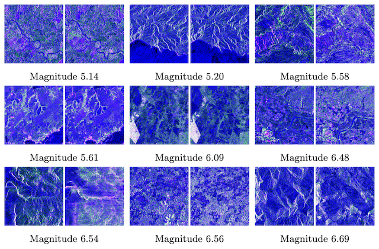

<div align="center">
<h2>Estimating Earthquake Magnitude in Sentinel-1 Imagery via Ranking</h2>

[**Daniele Rege Cambrin**](https://darthreca.github.io/)<sup>1</sup> · [**Isaac Corley**](https://isaacc.dev/)<sup>2</sup> · [**Paolo Garza**](https://dbdmg.polito.it/dbdmg_web/people/paolo-garza/)<sup>1</sup> · [**Peyman Najafirad (Paul Rad)**](https://scholar.google.com/citations?user=uoCn8c8AAAAJ&hl=en)<sup>2</sup>

<sup>1</sup>Politecnico di Torino, Italy&emsp;&emsp;&emsp;&emsp;<sup>2</sup>University of Texas at San Antonio, USA

**[ECML-PKDD 2024 MACLEAN Workshop](https://sites.google.com/view/maclean24/home)**

<a href="https://arxiv.org/abs/2407.18128"></a>
<a href='https://huggingface.co/datasets/DarthReca/quakeset'></a>
</div>

**In this paper, we propose to pose the estimation of earthquake magnitudes as a metric-learning problem, training models to not only estimate earthquake magnitude from Sentinel-1 satellite imagery but to additionally rank pairwise samples**. Our experiments show at max a 30%+ improvement in MAE over prior regression-only based methods, particularly transformer-based architectures.


<p align="center">
    <br/>
    <b>Figure 1.</b> QuakeSet samples varied by earthquake magnitude. Each sample contains a pair of pre and post earthquake event Sentinel-1 (SAR) imagery containing 2 bands (VV & VH). The samples in this figure are plotted as false color images (VV, VH, VV/VH) along with their magnitudes.
</p>

### Install Dependencies

```bash
pip install -r requirements.txt
```

### Dataset

We utilize the [TorchGeo](https://github.com/microsoft/torchgeo) implementation of the [QuakeSet dataset](https://arxiv.org/abs/2403.18116) in our experiments. It can be downloaded automatically by running the following:

```python
from torchgeo.datasets import QuakeSet

root = "path/to/download/folder"
dataset = QuakeSet(root, download=True)
```

### Training

Make sure to edit the config files in the `configs/` folder to specify the timm backbone architecture and logger backend you desire to use. Then simply run

```bash
python train.py
```

### Evaluation

Given the path to the trained checkpoint run the following:

```bash
python test.py --checkpoint path/to/checkpoint.ckpt --device 0
```

## Citation

If you find this project useful, please consider citing:

```bibtex
@article{cambrin2024estimating,
  title={Estimating Earthquake Magnitude in Sentinel-1 Imagery via Ranking},
  author={Cambrin, Daniele Rege and Corley, Isaac and Garza, Paolo and Najafirad, Peyman},
  journal={arXiv preprint arXiv:2407.18128},
  year={2024}
}
```
